## Escuela Colombiana de Ingeniería
### Parcial Segundo Tercio

# STEFANIA GIRALDO BUITRAGO

## Historia de usuario #1

  -------------------------------------------------------------------------------------------------------------------------------------------------------------------------------------
  > **Como** Usuario de la plataforma de consultas médicas
  >
  > **Quiero** Poder consultar un paciente a partir de su número y tipo de identificación.
  >
  > **Para** Poder hacer una revisión de las consultas realizadas por un paciente cuyo documento ya conozco, y así evitar la búsqueda por el nombre del paciente.
  >
  > **Criterio de aceptación:** Se debe mostrar la fecha de nacimiento del paciente, su nombre, y cada una de las consultas realizadas. Las consultas deben estar organizadas de la más reciente (mostrados arriba) a la más antígua, y deben mostrar la fecha y el resúmen.

## Historia de usuario #2

  -------------------------------------------------------------------------------------------------------------------------------------------------------------------------------------
  > **Como** Usuario de la secretaría de salud de la plataforma
  >
  > **Quiero** Tener un reporte de las consultas de los menores de edad (menóres de 18 años) en las que en el resúmen se encuentren enfermedades contagiosas.
  >
  > **Para** Conocer con rapidez qué pacientes debo revisar y tomar medidas al respecto.
  >
  > **Criterio de aceptación:** El reporte NO debe requerir entrar parámetro alguno. Se considerán como enfermedades contagiosas: 'hepatitis' y 'varicela'. El reporte sólo debe contener el número y tipo de identificación  del paciente y la fecha de nacimiento, ordenados por edad de mayor a menor.
  -------------------------------------------------------------------------------------------------------------------------------------------------------------------------------------

El modelo de base de datos y de clases asociados a la implementación parcial son los siguientes:

A partir de la aplicación base suministrada, debe realizar lo siguiente:

Dado un número y tipo de identificacion de un paciente, mostrar el paciente y las consultas que ha realizado esde paciente.

Mostrar los pacientes menores de edad que en sus consultas se encuentren las enfermedades: hepatitis o varicela.

1.  (20%) A partir de la especificación hecha en los métodos
    *consultarPacientesPorId* y *consultarMenoresConEnfermedadContagiosa* de la fachada de
    servicios (la parte lógica de la aplicación), implemente sólo una prueba (la que considere más importante para validar las especificaciones y los criterios de aceptación). Siga el esquema usado en ServicesJUnitTest para poblar la base de datos volátil y verificar el comportamiento de las operaciones de la lógica.

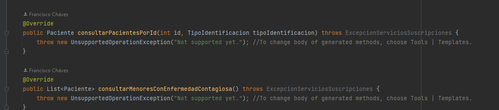
para las pruebas lo que se hizo fue ubicar el patron AAA
--------------------------------------------------------------------------------------------------------------------------------------------------------
>**Arrange** (*Organizar*): Inicializa los objetos y establece los valores de los datos que vamos a utilizar en el test que lo contiene
>
>**Act** (*Actuar*): Ejecuta el metodo o la acción que vamos a probar
>
>**Asssert** (*Confirmar*): Comprueba que el método de pruebas ejecutado se comporta como teníamos previsto que lo hiciera
--------------------------------------------------------------------------------------------------------------------------------------------------------------
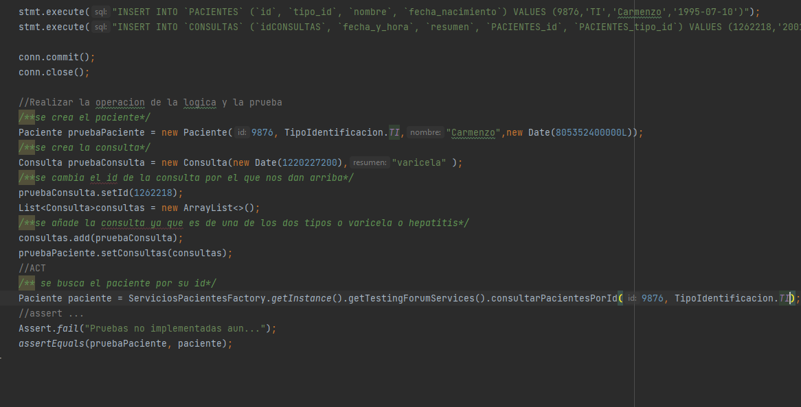
2.  (40%) Implemente la historia de usuario #1, agregando todo lo que haga falta en la capa de presentación, lógica y de persistencia. La vista debe implementarse en consultaPaciente.xhtml.
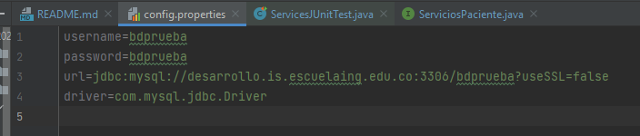

lo primero que se hizo es cambiar la contraseña ya que las creedenciales no son las correctas
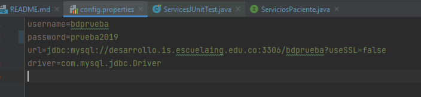
lo siguiente que se va hacer es relacionar la base de datos con las entidades del metodo.
vamos a el archivo "PacienteMapper.xml" y nos damos cuenta que la primera parte y la relacion esta correcta

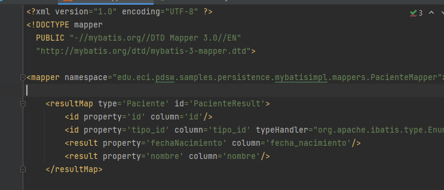
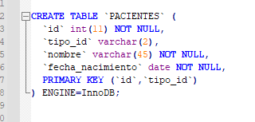

para realizar la consulta: Poder consultar un paciente a partir de su número y tipo de identificación.
vamos a utilizar el select que ya esta implementado y vamos a completar lo que falte.
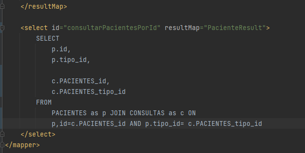
luego completamos la intefaz DAO dependiendo de los metodos antes vistos en los servicios del paciente
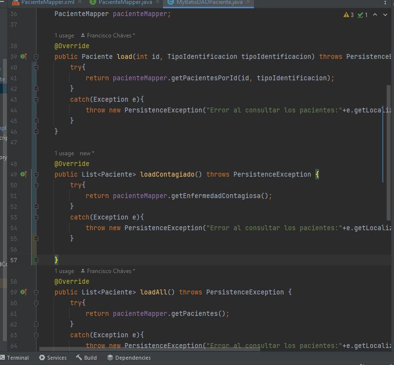
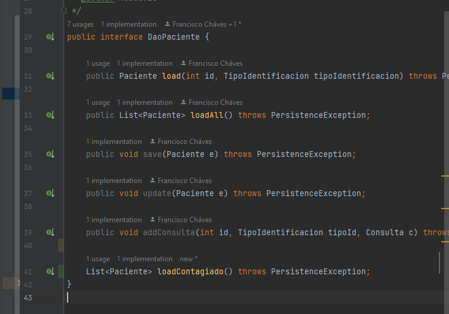
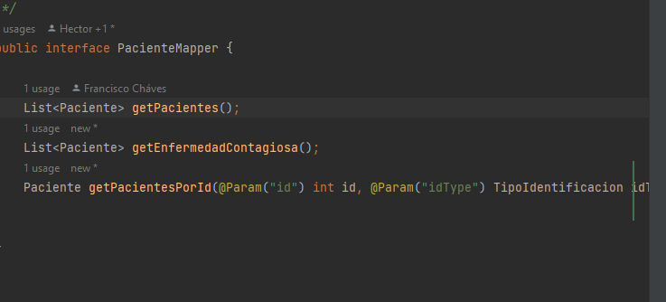
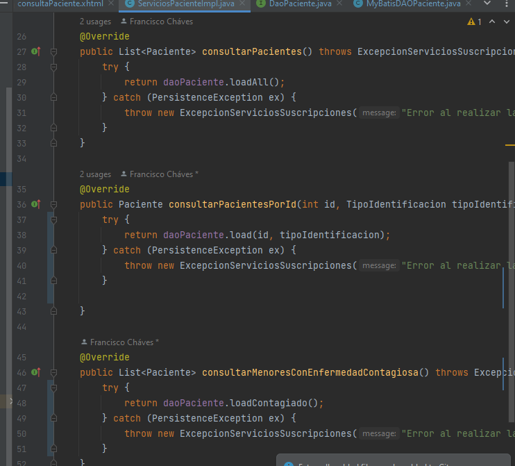
y realizamos la relacion entre la entidad y la base de datos
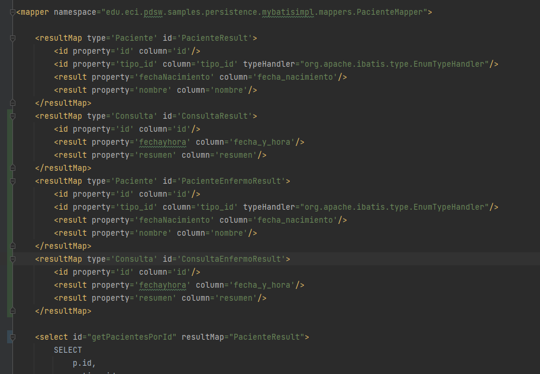
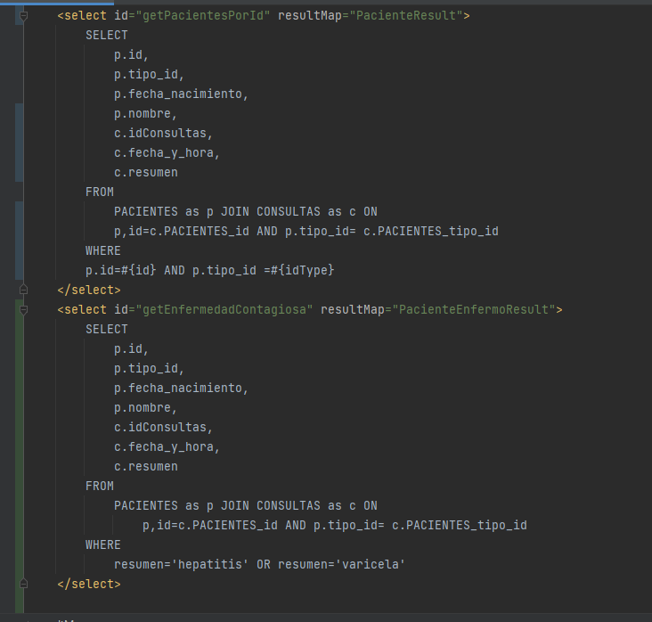
para hacer el front se llama solo metodos del been lo que haremos es hacer los metodos en el been llamando a los metodos que estan en servicios pacientes
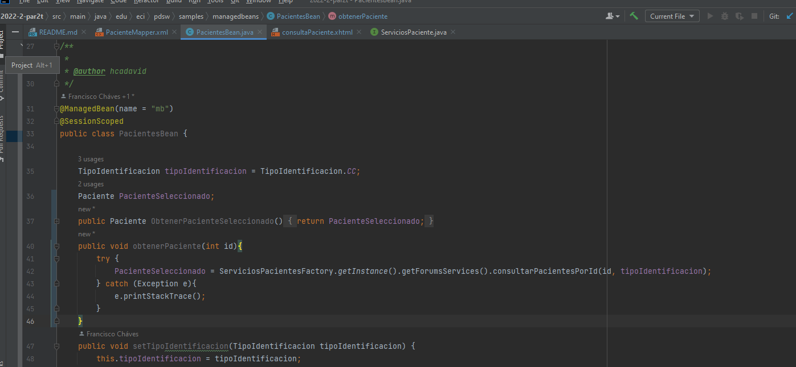
el siguiente paso es mejorar el front

3.  (40%)Implemente la historia de usuario #2, agregando todo lo que haga falta en la capa de presentación, lógica y de persistencia. La vista debe implementarse en consultarMenoresEnfermedadContagiosa.xhtml.

se realizara la implementacion en paciente bean para asi tener la relacion con el front
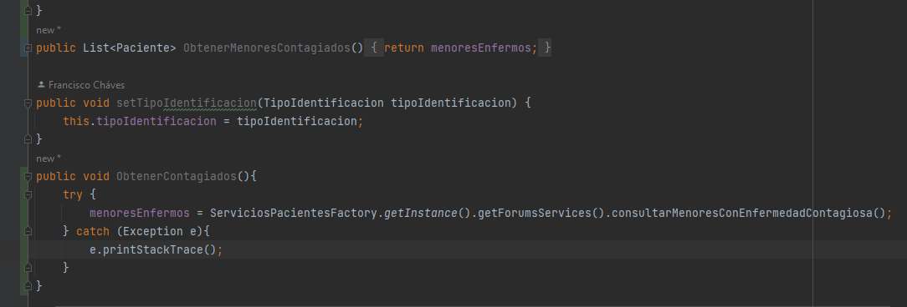
luego vamos a realizar los cambios en el front

